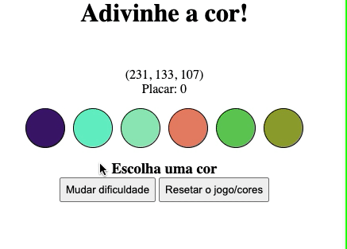

## Dia 5.8: Projeto - Adivinhe a cor

### &nbsp; Descrição do Projeto:
Desenvolver uma aplicação de um jogo de adivinhação de cores.
Ou seja, dada uma string RGB, será apresentado 6 visuais de cores, sendo uma delas a cor da string RGB.
Segue um exemplo de como o projeto pode se parecer depois de pronto:

  

## Requisitos do projeto (Obrigatórios)

### 1 - Adicione no seu site um título com o nome do seu jogo. :heavy_check_mark:

- O título deverá ter o `id` denominado `title`;

### 2 - Adicione um texto com o código RGB a ser adivinhado. :heavy_check_mark:

- O `id` deverá ser `rgb-color`;

- O texto deve conter os três números das cores RGB a ser adivinhada, no seguinte formato: `(168, 34, 1)`.

### 3 - Adicione a página opções de cores para serem adivinhadas :heavy_check_mark:

- Pelo menor 6 círculos como opção de cor;

- Todos os círculos devem possuir a classe `ball`;

### 4 - Adicione cores nas bolas de forma dinâmica. :heavy_check_mark:

- Ao carregar a página, as cores de cada um dos 6 circulos coloridos deve ser geradas via JavaScript.;

### 5 - Ao Clicar em um circulo colorido, deve ser mostrado um texto indicando se está correto. :heavy_check_mark:

- O `id` do elemento deve ser `answer`;

- Quando o jogo é iniciado, o texto exibido deve ser `"Escolha uma cor"`;

- Se o circulo colorido for o **correto**, deve ser exibido o texto "Acertou!"

- Se o circulo colorido for o **incorreto**, deve ser exibido o texto "Errou! Tente novamente!".

### 6 - Botão para iniciar/reiniciar o jogo. :heavy_check_mark:

- O botão deve ter o `id` `reset-game`;

- A clicar no botão, novas cores devem ser geradas via JavaScript e o elemento `rgb-color` deve ser atualizado.

- Ao clicar no botão, o elemento `answer` deve voltar ao estado inicial, exibindo o texto "Escolha uma cor".

## Requisitos Bônus:

### 7 - Placar que incremente 3 pontos para cada acerto no jogo. :heavy_check_mark:

- O elemento deve ter o `id` `score`;

- O valor inicial dele deve ser 0;

- A cada acerto, é incrementado 3 pontos ao placar;

- Ao clicar no botão reiniciar, o placar NÃO deve ser resetado.

<h3 align=center>Me encontre:</h3>

 

 
 <h1 align="center">
    
